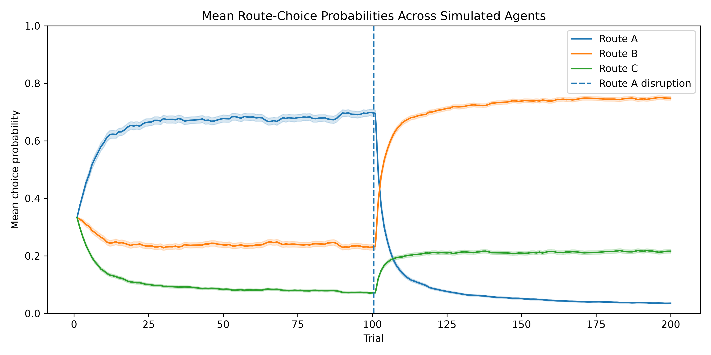
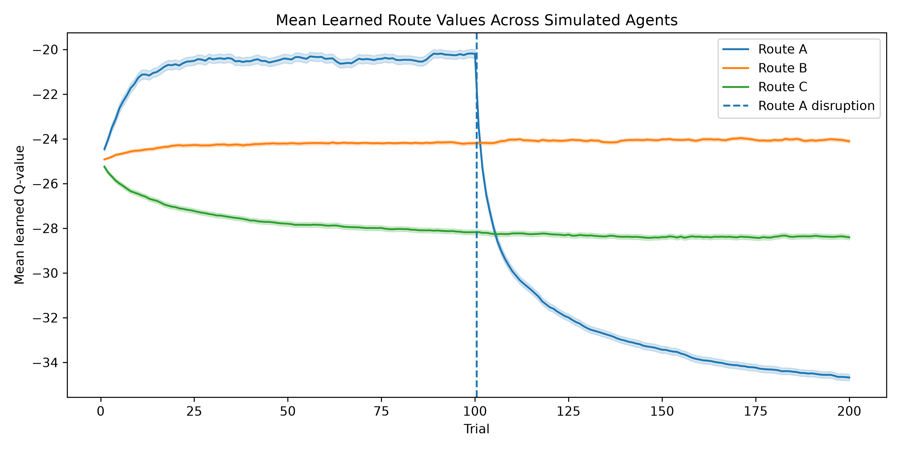
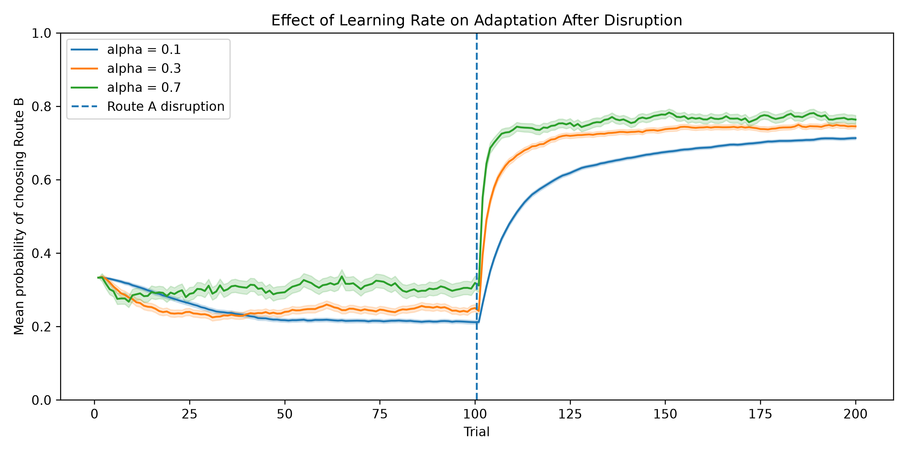
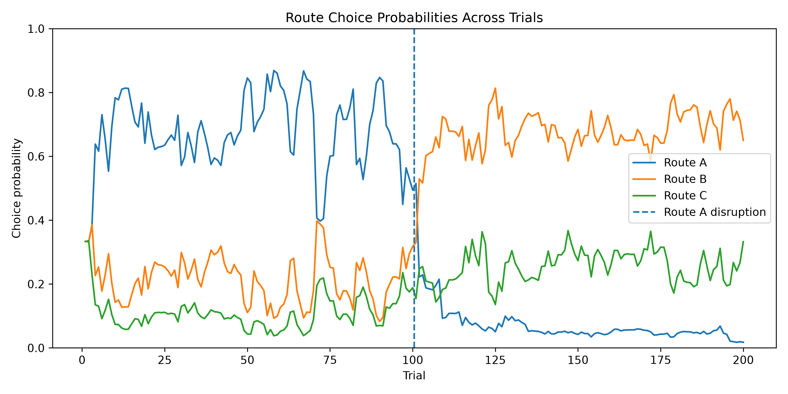
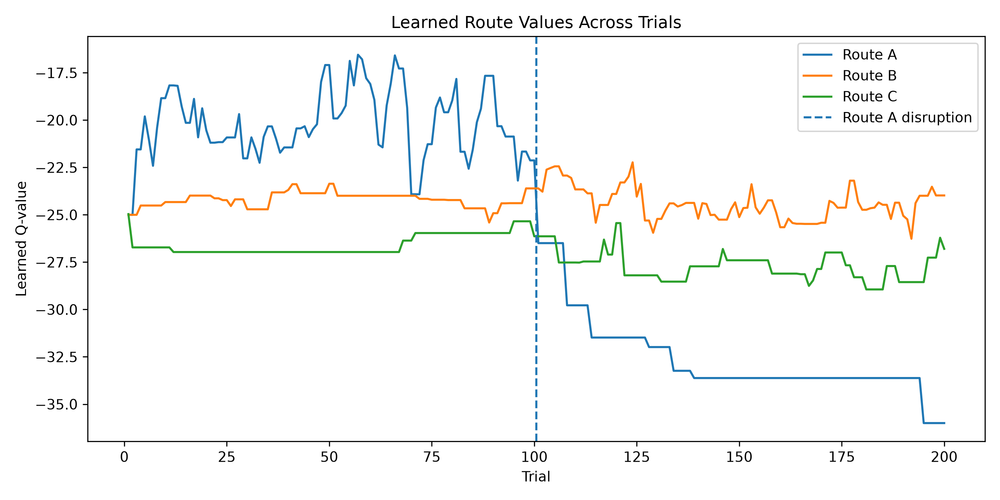
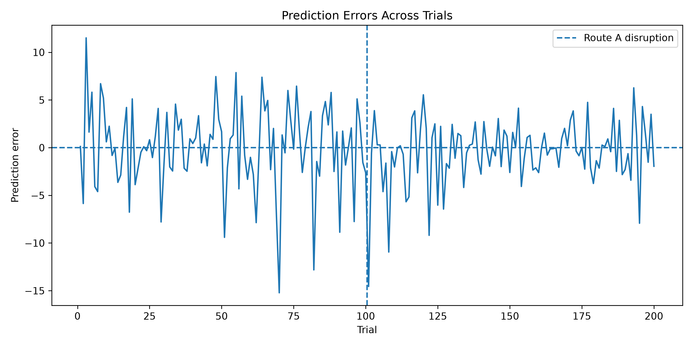

# Learning and Adaptation in Urban Route Choice

A small self-directed computational project exploring how repeated travel-time feedback can shape route preferences, how behaviour adapts after an environmental disruption, and how learning rate influences the speed of adaptation.

The project implements a simple reinforcement-learning model of sequential route choice in Python. Simulated agents repeatedly choose among three routes, experience stochastic travel times, update learned route values through prediction errors, and translate those values into future choices using a softmax decision rule.

The model is intentionally simple. Its purpose is not to provide a calibrated transport model, but to build and explore a transparent computational account of **learning, behavioural stabilisation, and adaptation in repeated route choice**.

---

## Research Questions

This project focuses on three questions:

1. How can repeated travel-time feedback lead to stable route preferences?
2. How does an agent adapt when a previously preferred route becomes substantially worse?
3. How does learning rate influence the speed and stability of adaptation following environmental change?

---

## Conceptual Setup

The simulated agent repeatedly travels between the same origin and destination and chooses among three possible routes.

| Route | Mean travel time | Standard deviation | Interpretation            |
| ----- | ---------------: | -----------------: | ------------------------- |
| A     |           20 min |              5 min | Fast but variable         |
| B     |           24 min |              2 min | Slower but stable         |
| C     |           28 min |              3 min | Less attractive initially |

Travel time on each trial is sampled from a normal distribution, so the same route can produce different outcomes across repeated journeys.

During Trials 1–100, Route A is the fastest route on average.

From **Trial 101 onward**, an environmental disruption changes Route A from:

[
20\text{ min} \rightarrow 35\text{ min}
]

Routes B and C remain unchanged.

This creates a simple learning-and-adaptation problem: the agent must first learn that Route A is relatively advantageous, then revise this preference after the environment changes.

The overall behavioural sequence is:

**exploration → learning → preference stabilisation → disruption → adaptation → new stabilisation**

---

## Reinforcement-Learning Model

### Reward

Shorter travel times are treated as better outcomes.

Reward is therefore defined as:

[
r_t=-\text{travel time}_t
]

Because reward is the negative of travel time, shorter journeys correspond to larger, less negative rewards.

For example:

* 20 min → reward = -20
* 24 min → reward = -24
* 28 min → reward = -28

Therefore, a higher Q-value represents a more favourable route.

---

### Learned Route Value

For each route, the agent maintains a learned value (Q(a)).

At the start of the simulation:

[
Q_A=Q_B=Q_C=-25
]

This means that the agent initially has no preference among the three routes and assumes that all have approximately similar value.

These Q-values are not the actual travel times. They represent the agent's current internal estimate of the expected reward associated with each route.

---

### Prediction Error

After choosing a route and experiencing its actual travel time, the agent compares the observed reward with its current expectation.

The prediction error is:

[
\delta_t=r_t-Q_t(a_t)
]

where:

* (r_t) is the experienced reward,
* (Q_t(a_t)) is the current expected value of the chosen route,
* (\delta_t) is the prediction error.

A positive prediction error means that the outcome was better than expected.

A negative prediction error means that the outcome was worse than expected.

For example, if the agent expects Route A to have:

[
Q_A=-25
]

but experiences a 15-minute journey:

[
r=-15
]

then:

[
\delta=-15-(-25)=10
]

The positive prediction error indicates that Route A performed better than expected.

---

### Value Updating

The learned value of the chosen route is updated according to:

[
Q_{t+1}(a_t)
============

Q_t(a_t)
+
\alpha
\left[
r_t-Q_t(a_t)
\right]
]

where (\alpha) is the **learning rate**.

The learning rate determines how strongly a new experience changes the agent's existing expectation.

A low learning rate produces gradual updating and stronger dependence on accumulated experience.

A high learning rate gives greater weight to recent outcomes and therefore allows faster responses to environmental change.

The default simulation uses:

[
\alpha=0.3
]

---

### Softmax Choice

Learning alone does not determine behaviour. The learned Q-values must also be translated into route choices.

The model therefore uses a softmax choice rule:

[
P(a)
====

\frac{e^{\beta Q(a)}}
{\sum_j e^{\beta Q(j)}}
]

where (\beta) is the **inverse temperature** parameter.

Routes with higher learned Q-values are more likely to be selected, but lower-valued routes still retain some probability of being explored.

Higher values of (\beta) make choices more strongly concentrated on the currently preferred route.

Lower values of (\beta) produce more exploratory behaviour.

The default model uses:

[
\beta=0.3
]

---

## Computational Loop

The full model can be summarised as:

```text
Current Q-values
      ↓
Softmax choice probabilities
      ↓
Route selection
      ↓
Experienced travel time
      ↓
Reward
      ↓
Prediction error
      ↓
Q-value update
      ↓
Next route choice
```

This creates a closed learning loop in which experience changes internal values, and internal values in turn influence future behaviour.

---

## Single-Agent Simulation

The first version of the project implements an illustrative single-agent simulation:

`src/route_learning.py`

The agent completes:

[
200
]

repeated route-choice trials.

This version is useful for inspecting trial-by-trial dynamics, including:

* route-choice probabilities,
* learned Q-values,
* prediction errors,
* adaptation following environmental disruption.

The single-agent results are intentionally retained because they make the internal learning process easy to inspect.

---

## Aggregate Simulation

Because a single simulated trajectory can be strongly influenced by stochastic travel-time outcomes, the project also includes a population-level simulation:

`src/aggregate_simulation.py`

The main aggregate analysis runs:

[
N=500
]

independent simulated agents.

Each agent:

* begins with the same initial Q-values,
* experiences independently sampled travel times,
* uses the same reinforcement-learning and softmax rules,
* completes 200 trials,
* encounters the same Route A disruption after Trial 100.

The aggregate analysis therefore evaluates whether the main behavioural patterns remain stable across repeated stochastic simulations rather than depending on a single random trajectory.

---

## Aggregate Statistics

For each trial, behaviour is aggregated across simulated agents.

The project reports:

* mean route-choice probabilities,
* mean learned Q-values,
* 95% confidence intervals across simulated agents.

Confidence intervals are calculated as:

[
\text{mean}
\pm
1.96\times SEM
]

where:

[
SEM=\frac{SD}{\sqrt{N}}
]

The shaded confidence intervals shown in the figures therefore quantify variability across **simulated agents**.

They should not be interpreted as empirical confidence intervals estimated from human participants.

---

# Results

## 1. Repeated Feedback Produces Stable Route Preferences

Across 500 independently simulated agents, Route A becomes increasingly preferred during the first 100 trials.

This occurs because repeated travel-time feedback gradually increases the learned value of Route A relative to Routes B and C.



The solid curves show mean route-choice probabilities across simulated agents.

The shaded regions represent 95% confidence intervals.

The pre-disruption period therefore demonstrates:

**initial exploration → value learning → increasing Route A preference → behavioural stabilisation**

---

## 2. Environmental Disruption Produces Behavioural Adaptation

At Trial 101, Route A changes from an average travel time of 20 minutes to 35 minutes.

The simulated agents are not explicitly informed that the environment has changed.

Instead, adaptation occurs through experience.

When an agent chooses Route A after the disruption, the unexpectedly poor travel-time outcome generates a negative prediction error.

This decreases the learned value of Route A.

As (Q_A) decreases, the softmax probability of selecting Route A also decreases.

Route B, whose average travel time remains 24 minutes, gradually becomes the preferred alternative.

The behavioural sequence is therefore:

**stable preference → unexpected poor outcomes → negative prediction errors → value updating → reduced Route A choice → increased Route B choice → new stabilisation**

---

## 3. Learned Q-Values Track Changes in Route Conditions

The aggregate Q-value trajectories show how the latent learned values underlying route choice evolve over time.



Before the disruption, the expected ordering becomes approximately:

[
Q_A>Q_B>Q_C
]

reflecting the fact that Route A offers the highest expected reward.

After Route A becomes substantially slower, its learned value progressively decreases.

The ordering eventually changes so that Route B has the highest learned value.

The behavioural shift observed in the route-choice probability figure can therefore be explained by an underlying change in learned route values.

---

## 4. Learning Rate Influences Adaptation Speed

To examine how latent learning parameters influence behavioural adaptation, additional simulations compare three learning rates:

[
\alpha=0.1,\quad0.3,\quad0.7
]

For each learning-rate condition:

[
N=500
]

independent agents are simulated.

The primary outcome is the probability of choosing Route B, which becomes the most advantageous route after the disruption.



Higher learning rates allow recent prediction errors to exert a stronger influence on Q-values.

As a result, agents with higher (\alpha) values generally adjust their route preferences more rapidly following the disruption.

Lower learning rates preserve previous experience more strongly and therefore produce slower adaptation.

This demonstrates how the same environmental change can generate different behavioural trajectories depending on latent learning parameters.

---

## Illustrative Single-Agent Dynamics

The aggregate simulations above represent the main results.

Single-agent figures are retained to illustrate the underlying trial-by-trial mechanisms.

### Route-Choice Probabilities



The agent gradually develops a preference for Route A before the disruption and subsequently shifts preference toward Route B.

---

### Learned Q-Values



The Q-value trajectories show how internal route-value estimates evolve as new outcomes are experienced.

---

### Prediction Errors



Prediction errors fluctuate around zero because travel times are stochastic.

Large negative prediction errors can occur when the agent experiences Route A after the disruption, providing the learning signal that drives downward updating of (Q_A).

---

# Interpretation

The model demonstrates a simple computational mechanism through which behavioural adaptation can emerge from repeated experience.

The main causal sequence is:

[
\text{experienced outcome}
\rightarrow
\text{prediction error}
\rightarrow
\text{value update}
\rightarrow
\text{choice probability}
\rightarrow
\text{behaviour}
]

Before the disruption, repeated feedback allows the agent to learn that Route A is relatively advantageous.

When the environment changes, previously learned expectations become inaccurate.

Unexpected outcomes generate prediction errors, which update latent route values and progressively alter future choices.

The learning-rate comparison further illustrates how differences in latent learning parameters can produce different adaptation trajectories even when agents experience the same underlying environment.

---

# Repository Structure

```text
urban-route-learning/
│
├── README.md
├── requirements.txt
│
├── src/
│   ├── route_learning.py
│   └── aggregate_simulation.py
│
├── figures/
│   ├── aggregate_choice_probabilities_ci.png
│   ├── aggregate_q_values_ci.png
│   ├── learning_rate_comparison_ci.png
│   ├── route_choice_probabilities.png
│   ├── q_values_across_trials.png
│   ├── prediction_errors_across_trials.png
│   └── learning_rate_comparison.png
│
└── results/
    ├── simulation_results.csv
    ├── aggregate_choice_summary.csv
    ├── aggregate_q_summary.csv
    └── learning_rate_summary.csv
```

---

# Running the Project

Install the required packages:

```bash
python -m pip install -r requirements.txt
```

Run the illustrative single-agent simulation:

```bash
python src/route_learning.py
```

Run the aggregate simulation:

```bash
python src/aggregate_simulation.py
```

The scripts automatically save generated figures to:

```text
figures/
```

and simulation summaries to:

```text
results/
```

---

# Dependencies

The project uses:

* Python
* NumPy
* pandas
* Matplotlib

See `requirements.txt` for the required packages.

---

# Reproducibility

The simulations use predefined random seeds so that results can be reproduced.

Each simulated agent receives an independent random seed while sharing the same:

* environment,
* initial Q-values,
* reinforcement-learning rule,
* softmax rule,
* disruption point,
* and model parameters within each condition.

All key modelling assumptions are explicitly defined in the source code.

---

# Limitations

This project is deliberately designed as a small and interpretable computational modelling exercise.

It should not be interpreted as a realistic or empirically calibrated model of human urban navigation.

Several important aspects of real navigation are not currently represented, including:

* spatial cognitive maps,
* network-level route structure,
* uncertainty about available alternatives,
* multiple travel attributes,
* habit formation,
* risk preferences,
* changing destinations,
* social and contextual influences,
* explicit knowledge of disruptions,
* neural or physiological measurements,
* empirical parameter estimation.

The Q-values used here represent simplified latent estimates of learned route value and should not be interpreted as direct representations of human cognitive maps.

---

# Possible Extensions

Future extensions could include:

* parameter recovery from simulated behavioural data,
* maximum-likelihood estimation of latent parameters,
* fitting the model to empirical route-choice data,
* heterogeneous learning and exploration parameters,
* partial or probabilistic disruptions,
* route closures rather than route degradation,
* alternative reinforcement-learning models,
* model comparison,
* out-of-sample prediction,
* richer representations of uncertainty,
* integration with neural or physiological measurements.

A particularly useful next step would be to move from forward simulation to parameter inference:

```text
Observed choices
      ↓
Computational model
      ↓
Estimate latent parameters
      ↓
Learning rate / choice consistency
```

This would allow the model to move from demonstrating possible behavioural dynamics toward inferring latent learning processes from observed behaviour.

---

# Project Motivation

This project was developed as a focused self-directed exercise in Python, reinforcement learning, and computational behavioural modelling.

The broader motivation is to understand how repeated experience shapes behaviour, how stable preferences are revised when environments change, and how latent learning processes may contribute to individual differences in adaptation.

Rather than attempting to build a complex navigation system, the project focuses on a small, transparent model whose assumptions and trial-by-trial computations can be directly inspected, modified, and interpreted.
